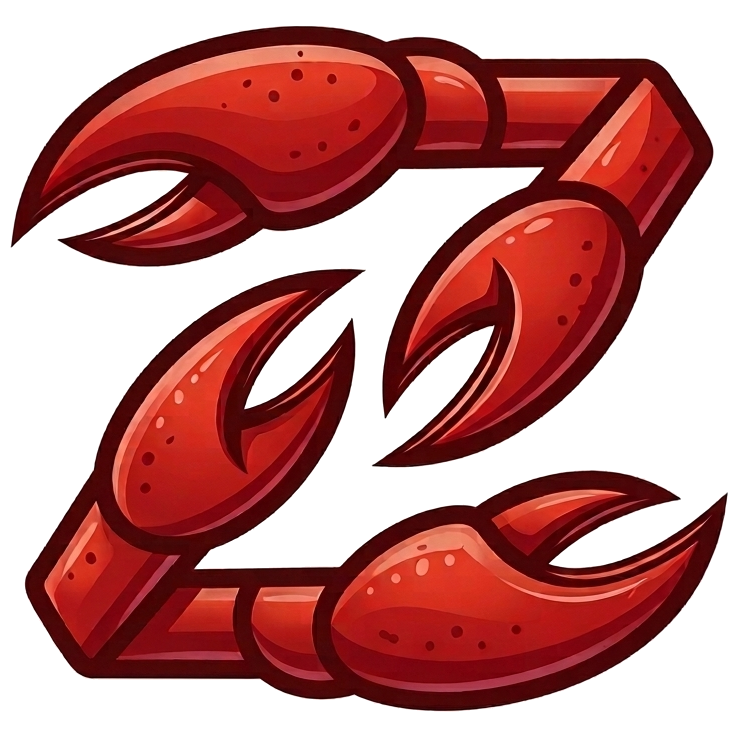

[English](README.md) | [中文](README.zh-CN.md)

<p align="center">
  
</p>

<p align="center">
  <strong>Official website for <a href="https://github.com/clawz-ai/ClawZ">ClawZ</a> — the OpenClaw AI Agent Scenario Workshop.</strong>
</p>

<p align="center">
  <a href="LICENSE"></a>
</p>

## Tech Stack

- [Astro 5](https://astro.build/) — static-first framework
- [React](https://react.dev/) — interactive islands
- [Tailwind CSS v4](https://tailwindcss.com/) — styling
- [Framer Motion](https://motion.dev/) — animations
- [TypeScript](https://www.typescriptlang.org/)

## Getting Started

```bash
# Install dependencies
pnpm install

# Start dev server
pnpm dev

# Build for production
pnpm build

# Preview production build
pnpm preview
```

## Project Structure

```
src/
├── components/     # Astro & React components
│   ├── hero/       # Hero section + download button
│   ├── features/   # Feature tabs with screenshots
│   ├── scenarios/  # Scenario showcase grid
│   ├── steps/      # How-it-works section
│   ├── tech/       # Tech highlights grid
│   ├── cta/        # Download CTA
│   ├── layout/     # Navbar & Footer
│   └── ui/         # Shared UI components
├── i18n/           # English & Chinese translations
├── layouts/        # Base HTML layout
├── pages/          # Route pages (en + zh)
├── data/           # Static data (features, scenarios)
└── styles/         # Global CSS & Tailwind theme
public/
├── screenshots/    # App screenshots (en + zh)
└── ...             # Logos, favicons
```

## i18n

The site supports English (default) and Chinese. English is served at `/`, Chinese at `/zh/`.

Translation files: `src/i18n/en.ts` and `src/i18n/zh.ts`.

## License

[MIT](LICENSE)
